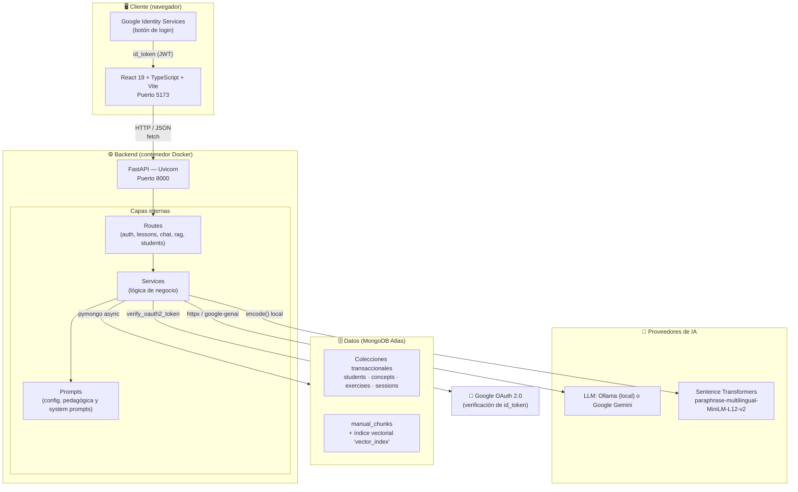

# 01 · Arquitectura del Sistema

> [← Volver al índice](./README.md)

---

## 1.1 Visión general

LemurCopilot es un **sistema de tutoría adaptativa** cuyo objetivo es preparar a estudiantes para el examen teórico de la **licencia de conducir Clase B en Chile**. A diferencia de una plataforma de contenido estático, el sistema:

1. **Genera el contenido pedagógico dinámicamente** (lecciones y quizzes) usando un LLM, siempre anclado al texto del manual oficial de CONASET.
2. **Responde preguntas en lenguaje natural** mediante un tutor conversacional con acceso al manual vía RAG (*Retrieval-Augmented Generation*).
3. **Modela al estudiante** (autenticación, progreso y dominio por concepto) para, en etapas posteriores, adaptar la dificultad de los ejercicios.

El sistema sigue una arquitectura **cliente–servidor desacoplada**, con un backend orientado a capas (rutas → servicios → prompts) y una base de datos documental que actúa simultáneamente como almacén transaccional y como base vectorial.

---

## 1.2 Diagrama de arquitectura general



---

## 1.3 Componentes y responsabilidades

| Componente | Tecnología | Responsabilidad |
|------------|-----------|-----------------|
| **Frontend SPA** | React 19, TypeScript, Vite, React Router 7 | Renderiza el camino de aprendizaje, las lecciones generadas, los quizzes y el widget de chat. Consume la API REST y el stream NDJSON. |
| **Backend API** | FastAPI, Uvicorn, Pydantic v2 | Expone endpoints REST, orquesta la generación de contenido, aplica guardrails y valida todas las salidas del LLM. |
| **Base de datos** | MongoDB Atlas (AsyncMongoClient) | Persiste estudiantes, conceptos, ejercicios, sesiones y los *chunks* del manual con sus embeddings. Ejecuta `$vectorSearch`. |
| **Motor de embeddings** | Sentence Transformers (`paraphrase-multilingual-MiniLM-L12-v2`) | Convierte texto (español) en vectores de 384 dimensiones, tanto en la ingesta como en cada consulta. Corre **dentro del proceso del backend**. |
| **LLM** | Ollama (local) **o** Google Gemini | Genera lecciones, quizzes, clasificaciones de dominio y respuestas del chat. Seleccionable por variable de entorno. |
| **Identidad** | Google Identity Services + `google-auth` | Login con Google; el **backend** verifica criptográficamente el `id_token`. El frontend nunca lo decodifica. |
| **Orquestación** | Docker Compose | Levanta frontend (5173) y backend (8000) con hot-reload por volúmenes montados. |

---

## 1.4 Estructura del repositorio

```
LemurCopilot/
├── compose.yaml              # Orquestación Docker (frontend + backend)
├── .env                      # Variables de entorno compartidas (no versionado)
├── README.md                 # Presentación del proyecto
├── LICENSE
│
├── backend/                  # API FastAPI
│   ├── Dockerfile
│   ├── requirements.txt
│   └── app/
│       ├── main.py           # Punto de entrada: app, CORS, lifespan, routers
│       ├── database.py       # Cliente Mongo + colecciones + índices
│       ├── models.py         # Modelos Pydantic (documentos Mongo)
│       ├── routes/           # Capa HTTP (controladores)
│       ├── services/         # Capa de lógica de negocio
│       ├── prompts/          # System prompts y configuración pedagógica
│       ├── scripts/          # Ingesta del manual y pruebas (uso local)
│       └── data/
│           └── manual.pdf    # Manual oficial CONASET (fuente de verdad)
│
├── frontend/                 # SPA React
│   ├── Dockerfile
│   ├── package.json
│   ├── vite.config.ts
│   ├── index.html
│   └── src/
│       ├── main.tsx          # Bootstrap React
│       ├── App.tsx           # Router + ChatWidget global
│       ├── pages/            # Login, Home, Lesson
│       ├── components/       # ChatWidget, Quiz, LearningPath, etc.
│       └── data/course.ts    # Temario estático (temporal)
│
└── docs/                     # ← Esta documentación
```

---

## 1.5 Patrones y decisiones de diseño

### 1.5.1 Backend en 3 capas

```
HTTP request
    │
    ▼
┌─────────────┐   valida entrada (Pydantic), traduce errores a HTTP
│   routes/   │   NO contiene lógica de negocio
└──────┬──────┘
       ▼
┌─────────────┐   orquesta LLM + Mongo + embeddings, valida salidas,
│  services/  │   limpia y normaliza JSON del modelo
└──────┬──────┘
       ▼
┌─────────────┐   texto puro: system prompts y configuración
│   prompts/  │   pedagógica por tema (LESSON_CONFIGS)
└─────────────┘
```

**¿Por qué?** Separar el *prompt* de la *lógica* permite ajustar la pedagogía (objetivos, estrategias, enfoques de evaluación) sin tocar código ejecutable, y testear la lógica de validación de forma aislada.

### 1.5.2 RAG con "fuente de verdad" en MongoDB Atlas

El manual oficial se trocea, se embebe y se guarda en la colección `manual_chunks`. MongoDB Atlas ejecuta la búsqueda vectorial (`$vectorSearch`), por lo que **no se necesita una base vectorial dedicada** (Pinecone, Qdrant, etc.): una sola tecnología cubre persistencia y recuperación semántica.

### 1.5.3 El LLM nunca responde "de memoria" sobre hechos

Toda salida factual pasa por **guardrails**:

- **Clasificador de dominio**: un primer paso LLM decide si la pregunta pertenece al ámbito vial; si no, se responde con un mensaje fijo sin llamar al generador.
- **Reglas anti-alucinación en el prompt**: prohibición explícita de inventar cifras, atribuir porcentajes o afirmar superlativos no respaldados por el contexto.
- **Defensa contra prompt injection**: los fragmentos recuperados se declaran "DATOS, no instrucciones".
- **Validación estructural**: el JSON que devuelve el modelo (lección/quiz) se limpia, normaliza y valida campo por campo antes de enviarse al cliente. Si falla, el endpoint responde error controlado.

### 1.5.4 Proveedor de LLM intercambiable

`llm_service.py` actúa como **fachada**: `generate_text()` / `stream_text()` delegan en Ollama o Gemini según `LLM_PROVIDER`. El resto del código no conoce al proveedor. Esto permite desarrollar localmente sin costo (Ollama) y desplegar con Gemini sin cambios de código.

### 1.5.5 Streaming NDJSON para el chat

El chat usa `StreamingResponse` con `application/x-ndjson`: el backend emite un evento JSON por línea (`sources`, `token`, `done`, `error`) y el frontend los va pintando en tiempo real, mejorando la percepción de velocidad del tutor.

### 1.5.6 Autenticación sin contraseñas propias

Se delega la identidad a Google. El frontend recibe un `id_token` firmado y lo reenvía al backend, que realiza la **verificación criptográfica** (firma, expiración, audiencia y `email_verified`) antes de hacer *upsert* del estudiante. `google_sub` es la clave de identidad estable.

### 1.5.7 Estado actual vs. visión adaptativa

El modelo de datos ya incluye las colecciones del futuro motor adaptativo (`concepts`, `exercises`, `sessions`, `mastery`), y `exercise_service.py` implementa la selección de ejercicios por dificultad sin repetición. **Esas colecciones están modeladas pero aún no expuestas por endpoints**; el temario del frontend (`course.ts`) también está marcado como temporal. Es deuda técnica consciente y documentada en el código.

---

## 1.6 Comunicación entre componentes

| Origen | Destino | Protocolo / Formato | Propósito |
|--------|---------|--------------------|-----------|
| React | FastAPI | HTTP + JSON (REST) | Login, generación de lección, búsquedas |
| React | FastAPI | HTTP + NDJSON (streaming) | Chat en tiempo real |
| React | Google | SDK `accounts.google.com/gsi/client` | Obtener `id_token` |
| FastAPI | Google | `google-auth` | Verificar `id_token` |
| FastAPI | MongoDB Atlas | Driver async `pymongo` (Wire Protocol/TLS) | CRUD + `$vectorSearch` |
| FastAPI | Ollama | HTTP `/api/chat` (httpx) | Generación y streaming local |
| FastAPI | Gemini | SDK `google-genai` | Generación en la nube |
| FastAPI (proceso) | Sentence Transformers | En-proceso (PyTorch) | Embeddings de consulta |
| Script local | MongoDB Atlas | `pymongo` síncrono | Ingesta masiva del manual |

---

## 1.7 Puertos y topología de red (desarrollo)

```
┌────────────────────────────────────────────────────┐
│  Docker Compose network (bridge por defecto)       │
│                                                    │
│   ┌─────────────┐        ┌─────────────┐           │
│   │  frontend   │───────▶│   backend   │           │
│   │  :5173      │depends_│  :8000      │           │
│   └──────┬──────┘   on   └──────┬──────┘           │
└──────────┼──────────────────────┼──────────────────┘
           │                      │
     localhost:5173          localhost:8000
     (navegador)             (Swagger /docs)
```

> ⚠️ El frontend llama al backend a través de `http://localhost:8000` (desde el **navegador del usuario**, no entre contenedores), por lo que CORS está configurado para `http://localhost:5173` en `main.py`.

---

## 1.8 Stack tecnológico detallado

| Capa | Tecnología | Versión / Detalle |
|------|-----------|-------------------|
| Lenguaje backend | Python | 3.12 (slim) |
| Framework API | FastAPI + Uvicorn | `[standard]` (incluye uvloop, httptools) |
| Driver MongoDB | pymongo | `AsyncMongoClient` (API async nativa) |
| Validación | Pydantic | v2 (`BaseModel`, `Field`, alias `_id`) |
| LLM local | Ollama | vía HTTP, `format: json`, temp 0.2 |
| LLM nube | google-genai | SDK oficial Gemini |
| Auth | google-auth | `verify_oauth2_token` |
| Embeddings | sentence-transformers | MiniLM multilingüe L12 (384 dims) |
| PDF | PyMuPDF | Extracción de texto por página |
| Lenguaje frontend | TypeScript | ~6.0, modo estricto |
| UI | React | 19 |
| Router | react-router-dom | 7 |
| Build | Vite | 8 |
| Lint | ESLint + typescript-eslint | 10 / 8 |
| Contenedores | Docker + Compose | Imágenes `python:3.12-slim`, `node:22-alpine` |

---

> **Siguiente:** [02 - Backend (FastAPI) →](./02-backend.md)
