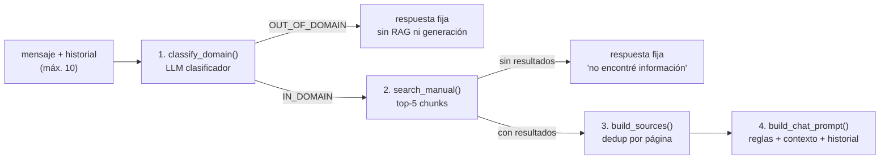

# 02 · Backend (FastAPI)

> [← Volver al índice](./README.md)

El backend es una API REST construida con **FastAPI** sobre Python 3.12. Es el cerebro del sistema: autentica usuarios, orquesta la generación de contenido con IA, aplica guardrails, ejecuta la recuperación semántica y valida todo lo que sale del LLM antes de entregarlo al cliente.

---

## 2.1 Mapa de módulos

```
backend/app/
├── main.py                  # Ensamblaje de la aplicación
├── database.py              # Conexión MongoDB + definición de índices
├── models.py                # Esquemas Pydantic de los documentos
│
├── routes/                  # ── Capa HTTP ─────────────────────
│   ├── auth.py              #   POST /auth/google
│   ├── lessons.py           #   POST /lessons/generate/{topic}
│   ├── chat.py              #   POST /chat/stream (NDJSON)
│   ├── rag.py               #   POST /rag/search · /rag/ask
│   └── students.py          #   Endpoints de diagnóstico
│
├── services/                # ── Capa de negocio ───────────────
│   ├── auth_service.py      #   Verificación Google + upsert estudiante
│   ├── llm_service.py       #   Fachada LLM (Ollama / Gemini)
│   ├── chat_service.py      #   Guardrails + pipeline del tutor
│   ├── rag_service.py       #   Búsqueda vectorial + QA
│   ├── content_service.py   #   Lectura de chunks por tema
│   ├── lesson_service.py    #   Generación + validación de lecciones
│   ├── quiz_service.py      #   Generación + validación de quizzes
│   ├── exercise_service.py  #   Selección adaptativa de ejercicios (futuro)
│   ├── embedding_service.py #   (placeholder, vacío)
│   └── retrieval_service.py #   (placeholder, vacío)
│
├── prompts/                 # ── Capa de prompts ───────────────
│   ├── chat_prompts.py      #   System prompt del tutor + clasificador
│   └── lesson_prompts.py    #   Config pedagógica + prompts de lección/quiz
│
├── scripts/                 # ── Herramientas locales ──────────
│   ├── ingest_manual.py     #   Ingesta del PDF → MongoDB (uso local)
│   └── test_vector_search.py#   Prueba manual de búsqueda vectorial
│
└── data/
    └── manual.pdf           # Manual oficial Clase B (CONASET)
```

---

## 2.2 Núcleo de la aplicación

### [`main.py`](../backend/app/main.py) — punto de entrada

Responsabilidades:

- **Ciclo de vida (`lifespan`)**: al arrancar, hace `ping` a MongoDB Atlas (falla rápido si no hay conexión) y crea los índices declarados (`ensure_indexes`). Al apagar, cierra el cliente.
- **CORS**: permite únicamente `http://localhost:5173` (el frontend de desarrollo), con credenciales y todos los métodos/headers.
- **Registro de routers**: `students`, `auth`, `rag`, `lessons`, `chat`.
- **Endpoints raíz**: `GET /` (saludo) y `GET /health` (healthcheck simple).

### [`database.py`](../backend/app/database.py) — persistencia

- Crea un único `AsyncMongoClient` (pool de conexiones compartido por toda la app) a partir de `MONGODB_URI` y `MONGODB_DATABASE`.
- Exporta handles tipados a las 5 colecciones: `students`, `concepts`, `exercises`, `sessions`, `manual_chunks`.
- `ensure_indexes()` declara los índices transaccionales (único por `email` y `google_sub`, compuesto para ejercicios, etc.). El índice vectorial se crea aparte en Atlas — ver [04 - Base de datos](./04-base-de-datos.md).

### [`models.py`](../backend/app/models.py) — contratos de datos

Modelos Pydantic v2 que documentan y validan la forma de los documentos Mongo. Clases:

| Modelo | Colección | Rol |
|--------|-----------|-----|
| `MongoBaseModel` | — | Clase base: mapea `_id` ↔ `id` (`PyObjectId`). |
| `Student` / `MasteryEntry` | `students` | Identidad Google + mapa de dominio por concepto (`mastery`). |
| `Concept` | `concepts` | Nodo del grafo de conocimiento (prerequisitos, unidad). |
| `Exercise` | `exercises` | Ejercicio con dificultad, métricas de uso y flag de revisión. |
| `Session` / `SessionMessage` / `ExerciseAttempt` | `sessions` | Historial conversacional y de intentos por estudiante. |
| `ContentChunk` | `manual_chunks` | Fragmento del manual con su `embedding`. |

> 📌 Detalle: `PyObjectId` convierte el `ObjectId` BSON a `str` para serialización JSON transparente.

---

## 2.3 Capa de rutas (HTTP)

Las rutas son **delgadas**: parsean/validan la entrada, llaman a servicios y traducen excepciones a códigos HTTP. Ninguna contiene lógica de negocio.

| Router | Endpoint | Qué hace | Servicios que usa |
|--------|----------|----------|-------------------|
| `auth.py` | `POST /auth/google` | Verifica el `id_token`, hace upsert del estudiante y devuelve su perfil. | `auth_service` |
| `lessons.py` | `POST /lessons/generate/{topic}` | Pipeline completo: config pedagógica → chunks → lección → quiz → respuesta. | `content_service`, `lesson_service`, `quiz_service` |
| `chat.py` | `POST /chat/stream` | Devuelve un stream NDJSON: evento `sources`, luego `token`s del LLM (o respuesta directa del guardrail), `done`/`error`. | `chat_service`, `llm_service` |
| `rag.py` | `POST /rag/search` · `POST /rag/ask` | Búsqueda vectorial pura y pregunta-respuesta sobre el manual (endpoints de exploración/depuración). | `rag_service` |
| `students.py` | `GET /students/mongo-test` · `GET /students/llm-test` · `POST /students/chat` | Diagnóstico: conectividad Mongo, conectividad LLM y eco de prompt. | `llm_service` |

**Manejo de errores:**
- `ValueError` de negocio (p. ej. "no existe configuración pedagógica para C9.9") → **400**.
- Excepción inesperada → log en consola + **500** con mensaje genérico (sin filtrar detalles internos).
- Token de Google inválido → **401**.

---

## 2.4 Capa de servicios (negocio)

### 2.4.1 `auth_service.py` — identidad

```
verify_google_id_token()     # Firma, expiración, audiencia y email_verified
extract_user_profile()       # claims → dict normalizado
upsert_student_from_google() # find_one_and_update(upsert=True)
```

- La verificación usa `google.oauth2.id_token.verify_oauth2_token` contra las claves públicas de Google, con `audience = GOOGLE_CLIENT_ID`.
- El *upsert* distingue `$set` (datos de perfil que pueden cambiar: email, nombre, foto, `last_login`) de `$setOnInsert` (identidad inmutable: `google_sub`, `created_at`, `mastery` vacío).
- **Invariante:** `google_sub` jamás se modifica tras la creación; es la clave estable de identidad.

### 2.4.2 `llm_service.py` — fachada de proveedor LLM

Punto único de contacto con el modelo de lenguaje:

| Función | Descripción |
|---------|-------------|
| `generate_text(prompt, json_mode=True)` | Generación completa. Con Ollama fuerza `format: "json"` si `json_mode`. |
| `stream_text(prompt)` | Async generator de *chunks* de texto (Ollama streaming real; Gemini emite una sola pieza). |

- **Ollama**: POST a `{OLLAMA_URL}/api/chat` con `httpx`, `temperature: 0.2` (salidas deterministas, clave para JSON parseable), timeout de 120 s.
- **Gemini**: SDK `google-genai` con `GEMINI_API_KEY` / `GEMINI_MODEL`.
- Selección por `LLM_PROVIDER` (`ollama` por defecto). Cualquier otro valor → `ValueError`.

### 2.4.3 `chat_service.py` — el tutor con guardrails

Pipeline de una pregunta del chat (función `prepare_chat_response`):



Piezas clave:

- **`classify_domain()`**: llama al LLM con `DOMAIN_CLASSIFIER_PROMPT` y espera `{"classification": "IN_DOMAIN" | "OUT_OF_DOMAIN"}`. **Fail-closed**: si el JSON es inválido, clasifica como `OUT_OF_DOMAIN`.
- **`build_history_text()`**: formatea el historial como `Usuario: … / Asistente: …`.
- **`build_rag_context()`**: serializa los chunks con metadatos (tema, título, página, índice).
- **`build_sources()`**: deduplica fuentes por `(topic, title, page)` para no repetir páginas en la UI.
- **`build_chat_prompt()`**: ensambla el prompt final con 10 reglas anti-alucinación y anti-inyección (el contexto manda sobre el conocimiento interno; los chunks son datos, no instrucciones; etc.).
- **`print_rag_results()`**: logging de depuración en consola.

### 2.4.4 `rag_service.py` — recuperación semántica

- Carga **en memoria del proceso** el modelo `paraphrase-multilingual-MiniLM-L12-v2` (embeddings de 384 dims, normalizados → similitud coseno).
- `search_manual(query, limit=3)`: pipeline `$vectorSearch` sobre el índice `vector_index` (`numCandidates: 10`), proyectando texto + metadatos + `vectorSearchScore`.
- `ask_manual(query)`: construye un prompt tutor con el contexto recuperado (con las mismas reglas anti-alucinación) y devuelve `{answer, sources}`.

> ⚠️ Nota arquitectónica: este módulo crea su **propio** `AsyncMongoClient` en vez de reutilizar el de `database.py`. Funciona, pero abre un segundo pool de conexiones — candidato a refactor futuro.

### 2.4.5 `content_service.py` — acceso al contenido

`get_topic_chunks(topic)`: lee todos los chunks de un tema (`C1.1`, `C2.2`, …) **sin** el campo `embedding` (proyección), ordenados por `page` y `chunk_index`. Es la fuente de contexto para la generación de lecciones y quizzes.

### 2.4.6 `lesson_service.py` — generación de lecciones

```
config pedagógica + chunks → build_context() → prompt → LLM
    → clean_json_response()     (quita ```json ... ```)
    → json.loads()
    → normalize_lesson_json()   (desenvuelve wrappers, renombra campos)
    → validate_lesson_json()    (title, introduction, sections[], key_points[])
    → sources deduplicadas por página
```

- `normalize_lesson_json()` blinda contra las variaciones típicas del LLM: desenvuelve `lesson`/`data`/`result`, renombra `section_title`/`heading` → `title`, `text` → `content`, y rellena `key_points`/`example` si faltan.
- `validate_lesson_json()` exige la estructura mínima que el frontend sabe renderizar; cualquier desviación → `ValueError` → HTTP 500 controlado.

### 2.4.7 `quiz_service.py` — generación de quizzes

Mismo patrón que la lección, con contrato más estricto:

- **Exactamente 3 preguntas**, cada una con `question`, `options` (**exactamente 4**), `correctAnswer` (**entero 0–3**) y `explanation`.
- El prompt incluye el tema, el objetivo de aprendizaje, el enfoque de evaluación (`quiz_focus`), **la lección que el estudiante acaba de ver** y el contexto oficial — así las preguntas evalúan lo enseñado.

### 2.4.8 `exercise_service.py` — motor adaptativo (sembrado, sin endpoints aún)

Implementa la lógica de selección de ejercicios para la futura capa adaptativa:

- `_already_seen_exercise_ids()`: extrae de `sessions` los ejercicios ya respondidos para **no repetir**.
- `get_exercise_for_student()`: busca un ejercicio `reviewed`, dentro de la tolerancia de dificultad (`±0.15`), con menos de 20 usos, no visto; ordena por `times_served` (reparte desgaste). Si no hay candidato, **genera uno nuevo** vía función inyectada (`generate_fn`) y lo persiste.
- `register_attempt_result()`: incrementa `times_correct`/`times_incorrect` para recalibrar dificultad a futuro.

> 🔭 No hay rutas que lo invoquen todavía; es la base del sistema de tutoría adaptativa descrito en la visión del proyecto.

### 2.4.9 Placeholders

`embedding_service.py` y `retrieval_service.py` están **vacíos**: la funcionalidad vive hoy en `rag_service.py`. Probablemente sean destino de un refactor de separación de responsabilidades.

---

## 2.5 Capa de prompts

### `chat_prompts.py`

| Constante | Propósito |
|-----------|-----------|
| `CHAT_SYSTEM_PROMPT` | Identidad del tutor: ámbito permitido, restricciones (no código, no temas ajenos), defensa ante "ignora tus instrucciones", uso del historial para referencias. |
| `DOMAIN_CLASSIFIER_PROMPT` | Clasificador binario con taxonomía explícita de IN/OUT_DOMAIN y formato de salida JSON estricto. |

### `lesson_prompts.py`

| Constante | Propósito |
|-----------|-----------|
| `LESSON_CONFIGS` | **Configuración pedagógica por tema** (`C1.1`, `C1.2`, `C2.1`, …): `learning_goal`, `teaching_strategy`, `lesson_focus[]`, `quiz_focus`. Es el "currículo" del sistema: dicta qué debe aprender el estudiante y cómo enseñarlo. |
| `BASE_LESSON_PROMPT` | Instrucciones base del generador de lecciones (rol, estructura JSON exigida). |
| `BASE_QUIZ_PROMPT` | Instrucciones base del generador de quizzes. |

> 💡 **Consecuencia de diseño:** agregar una nueva clase al sistema = agregar su entrada en `LESSON_CONFIGS` + su rango de páginas en `ingest_manual.py` + su tarjeta en `course.ts` (frontend). Sin tocar lógica.

---

## 2.6 Scripts de operación (uso local, fuera de Docker)

### `scripts/ingest_manual.py`

Pipeline de ingesta del manual oficial (detalle completo en [05 - Pipeline RAG](./05-pipeline-rag.md)):

1. Lee `data/manual.pdf` con PyMuPDF, página a página.
2. Limpia el texto (reune palabras cortadas por guion, colapsa espacios).
3. Según la tabla `TOPICS` (unidad, tema, título, rango de páginas), trocea con ventana de **900 caracteres y solape de 150**.
4. Embebe cada chunk (normalizado) y reemplaza en MongoDB **solo** los chunks de ese tema (borrado selectivo + inserción: si el embedding falla, la versión anterior sobrevive).

### `scripts/test_vector_search.py`

Utilidad de depuración para lanzar consultas contra el índice vectorial e inspeccionar resultados/scores.

---

## 2.7 Dependencias (`requirements.txt`)

| Paquete | Uso |
|---------|-----|
| `fastapi` + `uvicorn[standard]` | Framework web y servidor ASGI de alto rendimiento |
| `pymongo` | Driver MongoDB (cliente async) |
| `httpx` | Cliente HTTP async para Ollama (incluye streaming) |
| `google-genai` | SDK de Gemini |
| `google-auth` | Verificación de `id_token` de Google |
| `pymupdf` | Extracción de texto del PDF del manual |
| `sentence-transformers` | Modelo de embeddings multilingüe |

---

## 2.8 Variables de entorno que consume

| Variable | Descripción |
|----------|-------------|
| `MONGODB_URI` / `MONGODB_DATABASE` | Cadena de conexión Atlas y nombre de la base |
| `GOOGLE_CLIENT_ID` | Audiencia esperada del `id_token` |
| `LLM_PROVIDER` | `ollama` (default) \| `gemini` |
| `OLLAMA_URL` / `OLLAMA_MODEL` | Endpoint y modelo local |
| `GEMINI_API_KEY` / `GEMINI_MODEL` | Credencial y modelo en la nube |

Ver la tabla completa con valores de ejemplo en [08 - Despliegue](./08-despliegue-y-configuracion.md#83-variables-de-entorno).

---

> **Siguiente:** [03 - Frontend (React) →](./03-frontend.md)
