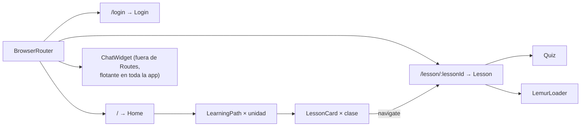

# 03 · Frontend (React + TypeScript + Vite)

> [← Volver al índice](./README.md)

El frontend es una **SPA** (Single Page Application) construida con React 19, TypeScript estricto y Vite. Su trabajo es presentar el camino de aprendizaje, renderizar el contenido generado por la IA (lecciones y quizzes), ofrecer el chat con el tutor y gestionar el login con Google.

---

## 3.1 Mapa de módulos

```
frontend/
├── index.html               # Shell HTML + script de Google Identity Services
├── vite.config.ts           # Dev server: host 0.0.0.0 + polling (Docker)
└── src/
    ├── main.tsx             # Bootstrap: monta <App/> en #root
    ├── App.tsx              # Router + <ChatWidget/> global
    ├── App.css / index.css  # Sistema de estilos (puro CSS, sin framework)
    ├── assets/              # Imágenes (mascota Lemur)
    │
    ├── data/
    │   └── course.ts        # Temario estático (units → lessons) ⚠ temporal
    │
    ├── pages/               # Vistas de nivel ruta
    │   ├── Login.tsx        #   /login
    │   ├── Home.tsx         #   /
    │   └── Lesson.tsx       #   /lesson/:lessonId
    │
    └── components/
        ├── GoogleSignInButton.tsx  # Botón oficial Google → /auth/google
        ├── LearningPath.tsx        # Sección de una unidad + progreso
        ├── LessonCard.tsx          # Tarjeta navegable de una clase
        ├── Quiz.tsx                # Motor de quiz interactivo
        ├── ChatWidget.tsx          # Chat flotante con streaming NDJSON
        └── LemurLoader.tsx         # Animación de carga de la mascota
```

---

## 3.2 Enrutamiento y composición raíz

[`App.tsx`](../frontend/src/App.tsx) define tres rutas y monta el chat de forma **global** (visible en todas las páginas):



| Ruta | Página | Datos que muestra |
|------|--------|-------------------|
| `/login` | `Login` | Botón de Google; errores de autenticación |
| `/` | `Home` | Hero, estadísticas (mock), camino de aprendizaje por unidad |
| `/lesson/:lessonId` | `Lesson` | Lección + quiz generados en vivo por el backend |

> ⚠️ **Sin guardas de ruta todavía:** `/` y `/lesson/:id` son accesibles sin sesión; el login existe pero no protege rutas (hay un `TODO` en `Login.tsx` sobre persistir la sesión).

---

## 3.3 Páginas

### 3.3.1 `Login.tsx`

- Renderiza [`GoogleSignInButton`](#354-googlesigninbutton) dentro de una tarjeta de marca.
- `handleSuccess(user)`: recibe el perfil verificado por el backend y navega a `/`. *TODO documentado en código:* persistir la sesión propia cuando el backend la emita.
- `handleError(err)`: muestra mensaje de error amigable en la tarjeta.

### 3.3.2 `Home.tsx`

Página de aterrizaje del estudiante. Composición declarativa:

- **Topbar**: marca + estadísticas de gamificación (`🔥 racha`, `⭐ XP`) — *valores mock hardcodeados*.
- **Hero**: propuesta de valor + CTA ancla (`#learning-path`) + mascota.
- **Quick stats**: tarjetas de preparación/racha/clases — *mock*.
- **Learning path**: itera `course` (de `data/course.ts`) y renderiza un `<LearningPath/>` por unidad.

### 3.3.3 `Lesson.tsx` — la vista más rica

Ciclo de vida al entrar a `/lesson/:lessonId`:

1. **Lookup estático**: busca la clase en `course.ts` por `lessonId`. Si no existe → pantalla "Clase no encontrada" 🚧.
2. **Petición de generación**: `POST {API_URL}/lessons/generate/{lessonId}` dentro de un `useEffect` con `AbortController` (cancela si el usuario navega antes de que termine la generación, que puede tardar decenas de segundos).
3. **Estados**: `loading` (muestra `LemurLoader`), `error` (mensaje + reintento), `generatedContent` (render).
4. **Render del contenido generado**: `title`, `introduction`, `sections[]` (cada una con `title`, `content`, `example` opcional), `key_points[]` y `sources[]` (páginas del manual citadas).
5. **Quiz**: botón para mostrar `<Quiz questions={...}/>`; las preguntas vienen en la **misma respuesta** que la lección (una sola ida y vuelta al backend).

Tipos de la respuesta (deben coincidir con el validador del backend):

```ts
interface GeneratedLesson {
  title: string
  introduction: string
  sections: { title: string; content: string; example?: string }[]
  key_points: string[]
}

interface GenerateLessonResponse {
  topic: string
  lesson: GeneratedLesson
  quiz: { questions: QuizQuestion[] }
  sources: { page: number; title: string; source: string }[]
}
```

---

## 3.4 Componentes

### 3.4.1 `LearningPath.tsx`

Recibe una `Unit` y pinta: cabecera de unidad (código + título), barra de progreso (0% *hardcodeado* — pendiente del modelo de progreso real) y la lista de `<LessonCard/>` numeradas.

### 3.4.2 `LessonCard.tsx`

Botón-tarjeta con número de parada, código (`C1.1`), duración estimada, título y descripción. Al hacer clic: `navigate('/lesson/' + lesson.id)`.

### 3.4.3 `Quiz.tsx`

Motor de quiz auto-contenido (estado local, sin backend):

- **Estado**: índice de pregunta actual + respuesta seleccionada.
- **Interacción**: al elegir una opción se bloquea la pregunta (`selectedAnswer !== null`), se marca correcta/incorrecta y se muestra la `explanation`. Botón "siguiente" avanza.
- **Progreso**: barra calculada como `(actual + 1) / total * 100`.

Contrato de datos:

```ts
interface QuizQuestion {
  question: string
  options: string[]        // exactamente 4 (validado en backend)
  correctAnswer: number    // índice 0–3
  explanation?: string
}
```

### 3.4.4 `GoogleSignInButton.tsx`

Integración con **Google Identity Services** (GIS):

- Carga el SDK desde `index.html` (`https://accounts.google.com/gsi/client`) y declara el tipado de `window.google.accounts.id` a mano (Google no publica `@types`).
- `initialize({ client_id: VITE_GOOGLE_CLIENT_ID, callback, ux_mode: 'popup' })` + `renderButton(...)` oficial de Google.
- **Flujo de seguridad**: el `credential` (JWT firmado por Google) **nunca se decodifica en el cliente**; se envía tal cual a `POST /auth/google` y solo se confía en la respuesta del backend.
- Notifica `onSuccess(user)` / `onError(error)` al padre (`Login`).

### 3.4.5 `ChatWidget.tsx` — cliente de streaming

Widget flotante disponible en toda la app. Piezas clave:

- **Estado**: `isOpen`, `message` (input), `loading` y `messages[]` (burbujas con `sources` opcionales). La primera burbuja es el saludo del tutor.
- **Historial acotado**: envía solo los **últimos 10 mensajes** al backend (coincide con el recorte que también hace el servidor).
- **Burbuja fantasma**: crea el mensaje del asistente **vacío** y lo va rellenando token a token.
- **Consumo NDJSON**: lee `response.body` con un `ReadableStream` reader, decodifica, parte por `\n` y despacha por `type`:

| Evento | Efecto en la UI |
|--------|-----------------|
| `sources` | Adjunta las fuentes (tema/título/página) a la burbuja del asistente |
| `token` | Concatena texto a la burbuja en tiempo real |
| `done` | Cierra el stream y habilita el input |
| `error` | Muestra mensaje de fallo en la burbuja |

### 3.4.6 `LemurLoader.tsx`

Animación de carga temática mostrada mientras el backend genera la lección (proceso que involucra dos llamadas al LLM).

---

## 3.5 Datos estáticos: `data/course.ts`

Define el temario navegable (`Unit[]` → `Lesson[]` con `id`, `code`, `title`, `description`). Hoy cubre Unidad 1 (C1.1, C1.2) y Unidad 2 (C2.1–C2.3).

> ⚠️ Marcado en código como temporal: *"POR AHORA, LUEGO ESTO DEBE VENIR DE BACKEND"*. El `id` de cada lección **es la clave de unión** con el backend: debe existir una entrada homónima en `LESSON_CONFIGS` (prompts) y chunks con ese `topic` en MongoDB.

---

## 3.6 Conexión con el backend

| Llamada | Origen (componente) | Endpoint | Modo |
|---------|--------------------|----------|------|
| Login | `GoogleSignInButton` | `POST /auth/google` | JSON simple |
| Generar lección + quiz | `Lesson` | `POST /lessons/generate/{topic}` | JSON simple (larga duración, abortable) |
| Chat tutor | `ChatWidget` | `POST /chat/stream` | **NDJSON streaming** |

La URL base se resuelve como:

```ts
const API_URL = import.meta.env.VITE_API_URL ?? 'http://localhost:8000'
```

**Patrones de robustez aplicados:**
- `AbortController` para cancelar la generación de lección al desmontar.
- Flags `active` para no actualizar estado tras desmontar.
- `.json().catch(() => null)` al leer errores, por si el cuerpo no es JSON.
- Validación de `response.ok` antes de parsear.

---

## 3.7 Configuración de build y tooling

| Archivo | Contenido relevante |
|---------|---------------------|
| [`vite.config.ts`](../frontend/vite.config.ts) | Plugin React; `server.host = 0.0.0.0` y `watch.usePolling = true` → **necesario para hot-reload dentro de Docker** en Windows. |
| `package.json` | Scripts: `dev` (vite), `build` (`tsc -b && vite build`), `lint`, `preview`. |
| `tsconfig*.json` | Proyecto referenciado (app/node), TypeScript estricto. |
| `eslint.config.js` | Flat config: `@eslint/js` + `typescript-eslint` + `react-hooks` + `react-refresh`. |
| `index.html` | Carga el script de Google Identity Services usado por `GoogleSignInButton`. |

---

## 3.8 Estado de la UI: qué es real y qué es mock

| Elemento | Fuente |
|----------|--------|
| Temario (unidades/clases) | Estático (`course.ts`) |
| Lección y quiz | **Backend + LLM (real, generado en vivo)** |
| Chat con fuentes citadas | **Backend RAG (real)** |
| Racha, XP, % preparación, clases completadas | Mock hardcodeado en `Home.tsx` |
| Barra de progreso por unidad | Mock (0%) en `LearningPath.tsx` |

---

> **Siguiente:** [04 - Base de datos (MongoDB) →](./04-base-de-datos.md)
