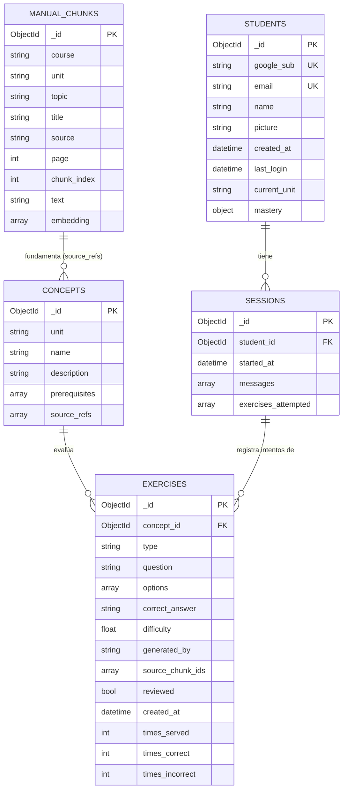
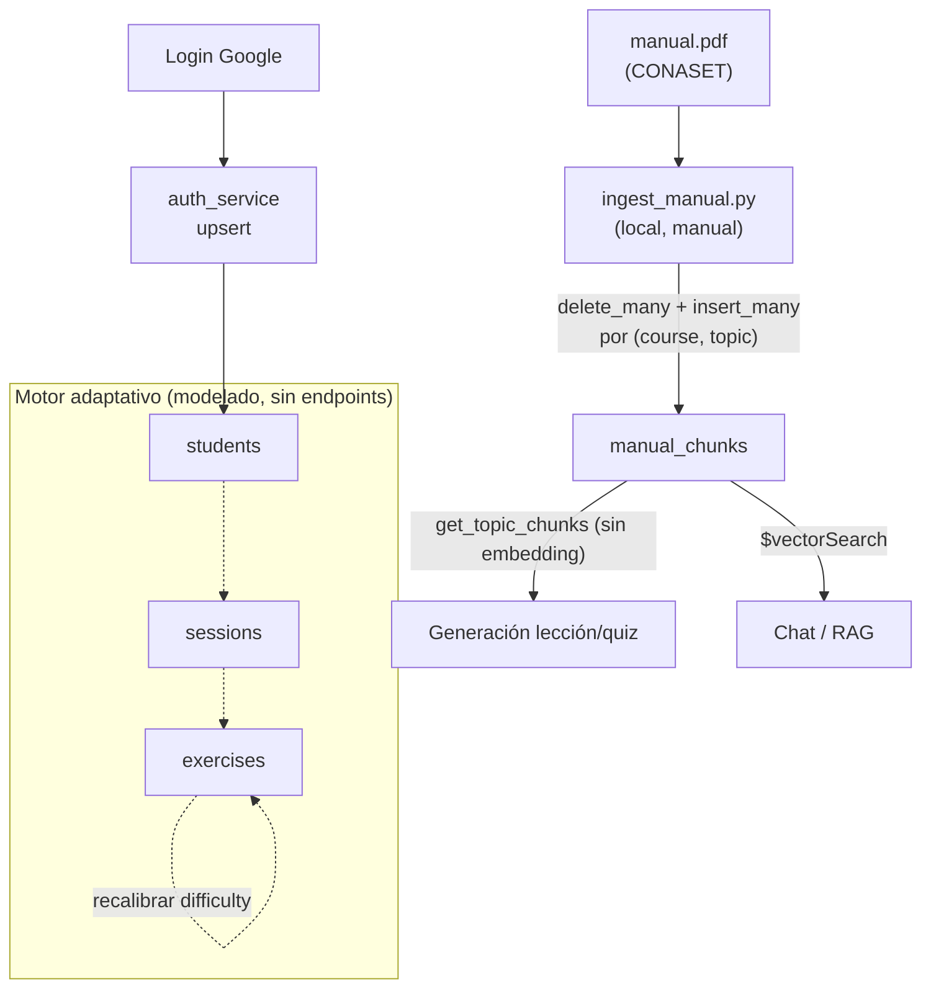

# 04 · Base de Datos (MongoDB Atlas)

> [← Volver al índice](./README.md)

LemurCopilot usa **MongoDB Atlas** con un doble rol:

1. **Base transaccional** — estudiantes, conceptos, ejercicios, sesiones.
2. **Base vectorial** — la colección `manual_chunks` almacena embeddings y se consulta con búsqueda semántica (`$vectorSearch`) mediante un índice vectorial de Atlas.

El acceso se realiza con `AsyncMongoClient` (API async nativa de `pymongo`), con un único cliente compartido definido en [`database.py`](../backend/app/database.py).

---

## 4.1 Vista general de colecciones



> Las colecciones `concepts`, `exercises` y `sessions` están **modeladas y con índices creados**, pero aún no expuestas por endpoints: son la base del futuro motor adaptativo (ver `exercise_service.py`).

---

## 4.2 Esquemas en detalle

Los modelos de referencia viven en [`backend/app/models.py`](../backend/app/models.py) (Pydantic v2). Convención: `_id` (BSON `ObjectId`) se mapea a `id: str` en Python/JSON vía `MongoBaseModel`.

### 4.2.1 `students` — identidad y modelo del estudiante

| Campo | Tipo | Descripción |
|-------|------|-------------|
| `google_sub` | string | **Clave de identidad estable** (claim `sub` de Google). Inmutable tras creación. |
| `email` | string | Único; actualizable en cada login (puede cambiar en la cuenta Google). |
| `name` / `picture` | string | Perfil visible; `picture` opcional. |
| `created_at` / `last_login` | datetime | Auditoría de ciclo de vida. |
| `current_unit` | string \| null | Unidad en la que está trabajando. |
| `mastery` | objeto (`dict[str, MasteryEntry]`) | **Modelo de dominio**: mapa `concept_id → { score, attempts, last_seen }`. Nace vacío. |

Escritura: únicamente por `upsert_student_from_google()` (`$set` perfil + `$setOnInsert` identidad).

### 4.2.2 `concepts` — grafo de conocimiento

| Campo | Tipo | Descripción |
|-------|------|-------------|
| `unit` | string | Unidad curricular (índice simple). |
| `name` / `description` | string | Nombre y descripción del concepto. |
| `prerequisites` | ObjectId[] | Aristas del grafo: conceptos previos requeridos. |
| `source_refs` | ObjectId[] | Referencias a chunks del manual que fundamentan el concepto. |

### 4.2.3 `exercises` — banco de ejercicios con métricas

| Campo | Tipo | Descripción |
|-------|------|-------------|
| `concept_id` | ObjectId | Concepto evaluado. |
| `type` | enum | `multiple_choice` \| `true_false` \| `open`. |
| `question` / `options` / `correct_answer` | — | Enunciado, alternativas y solución. |
| `difficulty` | float (0–1) | Dificultad objetivo; selección con tolerancia ±0.15. |
| `generated_by` | enum | `llm` \| `manual`. |
| `source_chunk_ids` | ObjectId[] | Trazabilidad al manual. |
| `reviewed` | bool | **Solo ejercicios revisados se sirven** a estudiantes. |
| `times_served` / `times_correct` / `times_incorrect` | int | Métricas de uso: reparten desgaste (máx. 20 servidos) y permiten recalibrar `difficulty`. |

### 4.2.4 `sessions` — historial de interacción

| Campo | Tipo | Descripción |
|-------|------|-------------|
| `student_id` | ObjectId | Dueño de la sesión (índice simple). |
| `started_at` | datetime | Inicio. |
| `messages` | subdocumentos[] | `{ role: agent\|student, content, timestamp }`. |
| `exercises_attempted` | subdocumentos[] | `{ exercise_id, correct, timestamp }` — fuente para el anti-repetición de `exercise_service`. |

### 4.2.5 `manual_chunks` — corpus RAG (colección activa principal)

| Campo | Tipo | Descripción |
|-------|------|-------------|
| `course` | string | Identificador del curso (`clase-b-conaset-2024`). Permite convivencia de varios manuales. |
| `unit` | string | Unidad (`C1`, `C2`, …). |
| `topic` | string | **Clave de negocio** (`C1.1`, `C2.2`, …): une la ingesta, `LESSON_CONFIGS` y el `course.ts` del frontend. |
| `title` | string | Título del tema. |
| `source` | string | Documento fuente (`manual_conduccion_clase_b`). |
| `page` | int | Página impresa del manual → **citación** en la UI. |
| `chunk_index` | int | Orden del fragmento dentro de la página. |
| `text` | string | Contenido (ventanas de ~900 caracteres, solape 150). |
| `embedding` | float[384] | Vector generado con MiniLM multilingüe, **normalizado** (similitud coseno). |

Escritura: solo `scripts/ingest_manual.py` (borrado selectivo por `(course, topic)` + inserción).

---

## 4.3 Índices

### 4.3.1 Índices transaccionales (creados por `ensure_indexes()` al arrancar)

| Colección | Índice | Tipo | Motivo |
|-----------|--------|------|--------|
| `students` | `email` | único | Deduplicación por correo |
| `students` | `google_sub` | único | Clave de login (upsert) |
| `exercises` | `(concept_id, difficulty, reviewed)` | compuesto | Query exacta del selector adaptativo |
| `sessions` | `student_id` | simple | Historial por estudiante |
| `concepts` | `unit` | simple | Listados por unidad |

### 4.3.2 Índice vectorial (se crea **manualmente en Atlas**, fuera del código)

La búsqueda semántica requiere un índice de tipo **vectorSearch** llamado exactamente `vector_index` sobre `manual_chunks`:

```json
{
  "fields": [
    {
      "type": "vector",
      "path": "embedding",
      "numDimensions": 384,
      "similarity": "cosine"
    }
  ]
}
```

> ⚠️ **Dependencia operativa crítica:** si el índice no existe o tiene otro nombre, `search_manual()` falla en runtime. Debe crearse en Atlas UI → *Search Indexes* (o vía Atlas API). Como los embeddings se normalizan (`normalize_embeddings=True`), la similitud coseno equivale al producto punto.

La consulta que lo usa (`rag_service.py`):

```python
{
  "$vectorSearch": {
    "index": "vector_index",
    "path": "embedding",
    "queryVector": <vector de la consulta>,
    "numCandidates": 10,   # vecinos evaluados por el índice ANN
    "limit": limit         # 3 en /rag, 5 en chat
  }
}
```

---

## 4.4 Ciclo de vida de los datos



| Colección | Escritor | Lectores |
|-----------|----------|----------|
| `manual_chunks` | Script de ingesta (local) | `content_service`, `rag_service` |
| `students` | `auth_service` (upsert en login) | `auth_service` |
| `concepts` | *(aún nadie)* | *(aún nadie)* |
| `exercises` | `exercise_service` (generación + métricas) | `exercise_service` |
| `sessions` | *(aún nadie)* | `exercise_service` (anti-repetición) |

---

## 4.5 Decisiones y notas operativas

- **Sin esquema estricto a nivel Mongo**: la validación vive en la capa de aplicación (Pydantic). Los modelos son el contrato; Mongo no fuerza `validators`.
- **`mastery` como mapa embebido**: evita una colección extra y una join por estudiante; escala bien porque el número de conceptos por curso es acotado.
- **Trazabilidad RAG → ejercicios**: `source_chunk_ids` permitirá auditar de qué fragmentos del manual salió cada ejercicio generado.
- **Anti-fatiga del banco de ejercicios**: `times_served < 20` + orden ascendente reparte el uso entre ejercicios equivalentes.
- **El índice vectorial no está en `ensure_indexes()`** a propósito: los índices vectoriales de Atlas no se crean por el driver, sino por la API/UI de Atlas Search.

---

> **Siguiente:** [05 - Pipeline RAG →](./05-pipeline-rag.md)
