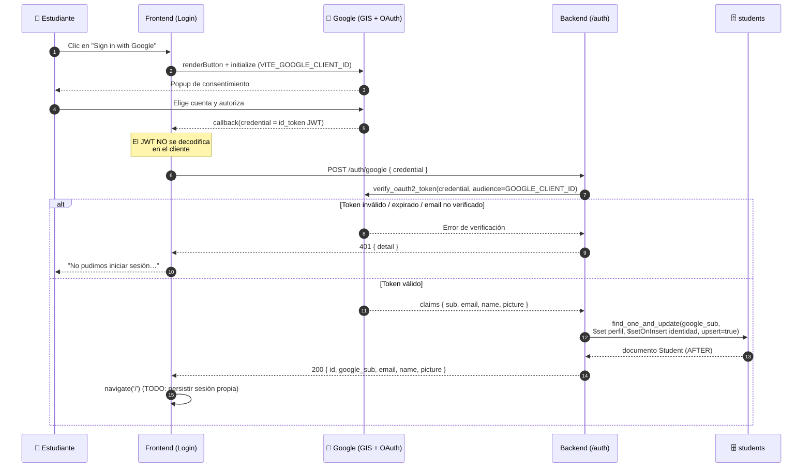
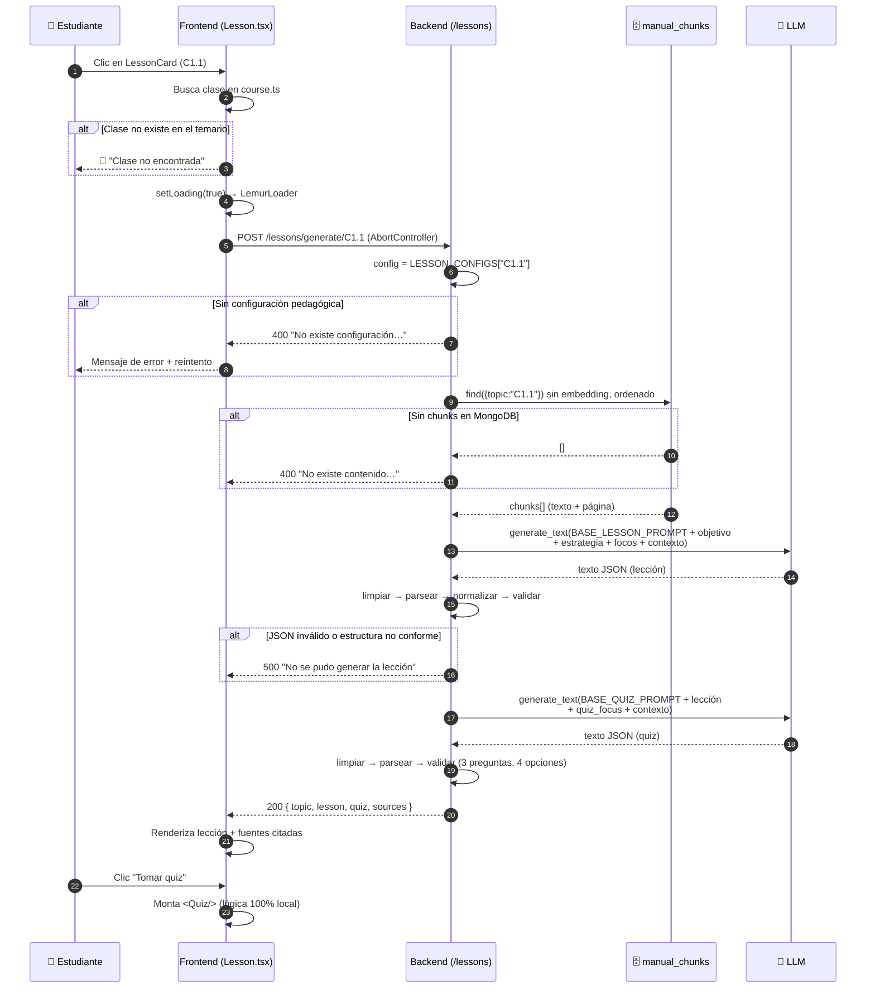
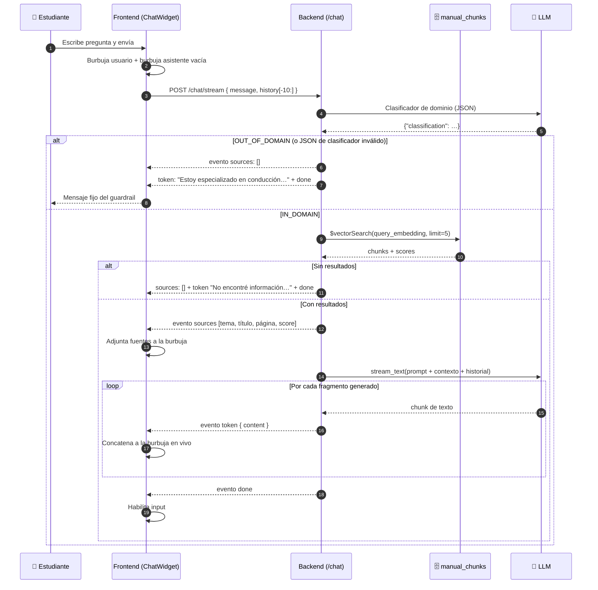
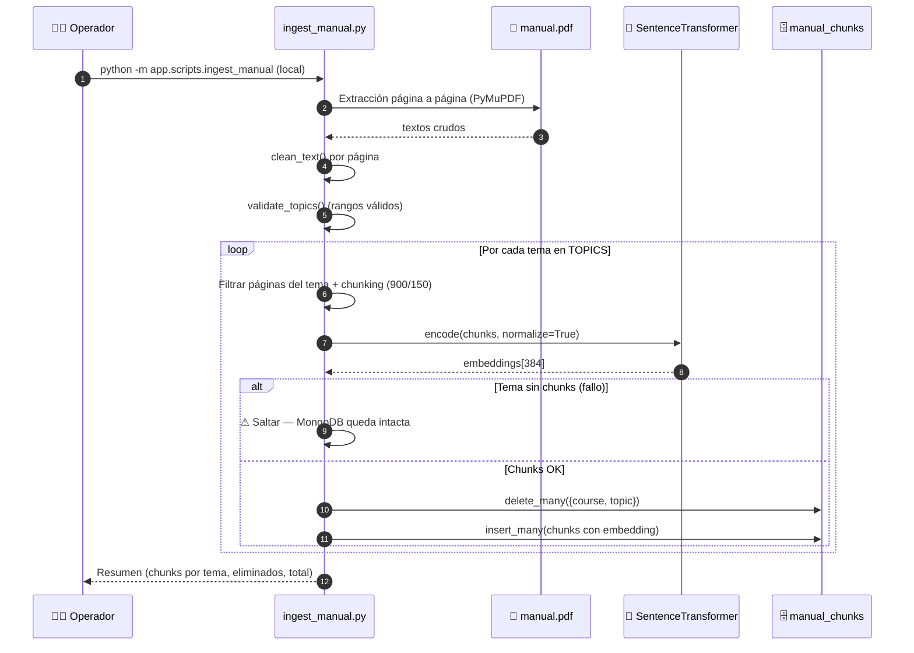
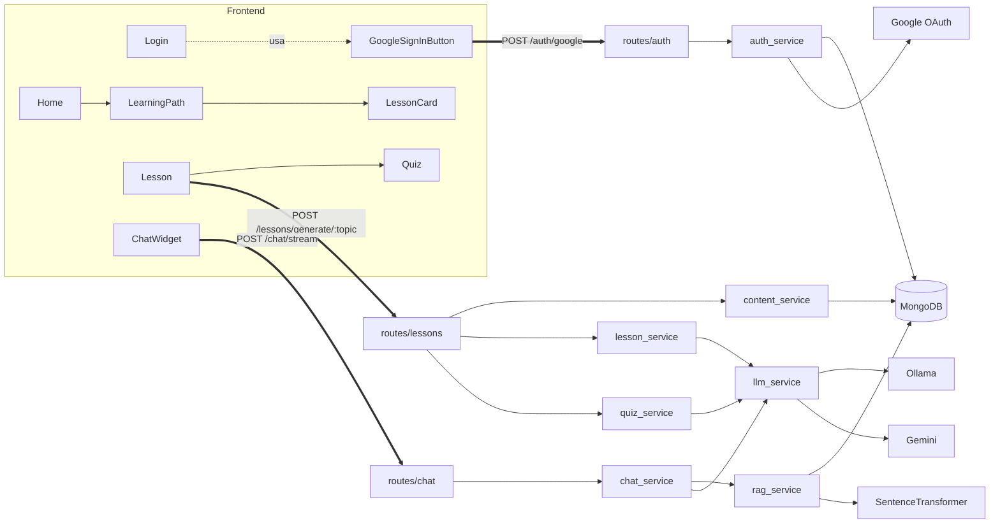

# 07 · Flujos End-to-End

> [← Volver al índice](./README.md)

Diagramas de secuencia de los cuatro flujos principales del sistema, desde la acción del usuario hasta la persistencia. Actores abreviados:

- **👤** Estudiante · **FE** Frontend (React) · **BE** Backend (FastAPI)
- **🗄️** MongoDB Atlas · **🤖** LLM (Ollama/Gemini) · **🔐** Google

---

## 7.1 Flujo de autenticación con Google

**Puntos clave:**
- La verificación criptográfica ocurre **solo en backend** (firma + audiencia + expiración + `email_verified`).
- `google_sub` es la clave de identidad inmutable; el perfil se actualiza en cada login.
- El mismo endpoint sirve para registro (primer login) y login recurrente (upsert).

---

## 7.2 Flujo de generación de lección + quiz

Este es el flujo pedagógico central: una sola petición del frontend desencadena **dos llamadas al LLM** y dos validaciones.

**Puntos clave:**
- La petición es **abortable**: si el usuario navega fuera, `AbortController` cancela el `fetch`.
- Las **fuentes** (páginas del manual) viajan deduplicadas para citación en la UI.
- El quiz se corrige en el cliente; no se reportan resultados al backend todavía.

---

## 7.3 Flujo del chat tutor (streaming)

**Puntos clave:**
- Protocolo NDJSON: un JSON por línea; el frontend despacha por `type` (`sources`, `token`, `done`, `error`).
- **Doble recorte de historial**: el widget envía máx. 10 y el servidor vuelve a recortar (defensa en profundidad).
- Las respuestas del guardrail y de "sin contexto" **no gastan generación**: viajan como un único token.
- Cabeceras anti-buffering para que los tokens lleguen en tiempo real.

---

## 7.4 Flujo offline de ingesta del manual

Proceso operativo ejecutado a mano por el equipo (no forma parte del runtime de los contenedores):

**Post-requisito manual:** el índice `vector_index` de Atlas Search debe existir (se crea una vez por clúster, ver [04 - Base de datos](./04-base-de-datos.md#432-índice-vectorial-se-crea-manualmente-en-atlas-fuera-del-código)).

---

## 7.5 Vista combinada: quién llama a quién

---

> **Siguiente:** [08 - Despliegue y configuración →](./08-despliegue-y-configuracion.md)
