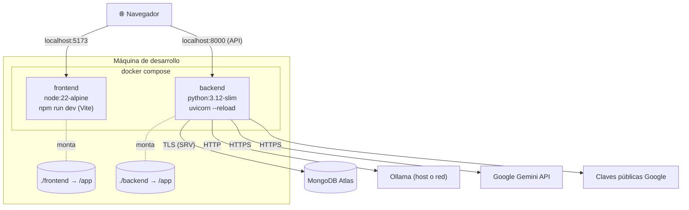

# 08 · Despliegue y Configuración

> [← Volver al índice](./README.md)

Guía operativa para levantar LemurCopilot en desarrollo (Docker Compose), con el inventario completo de variables de entorno, dependencias externas y tareas operativas puntuales.

---

## 8.1 Topología de despliegue



---

## 8.2 Puesta en marcha (desarrollo)

### Prerrequisitos

1. **Docker Desktop** con Compose.
2. **Clúster de MongoDB Atlas** con:
   - Base de datos creada.
   - **Índice vectorial `vector_index`** sobre `manual_chunks.embedding` (384 dims, coseno) — ver [§4.3.2](./04-base-de-datos.md#432-índice-vectorial-se-crea-manualmente-en-atlas-fuera-del-código).
   - IP del entorno permitida en *Network Access*.
3. **Contenido ingestado**: ejecutar al menos una vez el script de ingesta (§8.5), o las lecciones responderán `400`.
4. **Proveedor LLM** operativo:
   - *Ollama*: servicio accesible en `OLLAMA_URL` con el modelo descargado (`ollama pull <modelo>`), **o**
   - *Gemini*: `GEMINI_API_KEY` válida.
5. **Cliente OAuth de Google** (tipo *Web*) con `http://localhost:5173` como origen autorizado.

### Arranque

```bash
docker compose up --build
```

| Servicio | URL |
|----------|-----|
| Frontend | http://localhost:5173 |
| Backend | http://localhost:8000 |
| Swagger | http://localhost:8000/docs |

Ambos contenedores montan el código fuente como volumen → **hot-reload** al editar (Vite usa `usePolling` para detectar cambios en Windows/Docker; Uvicorn corre con `--reload`).

> 📌 `depends_on` solo ordena el arranque: el frontend no espera a que el backend esté *sano* (no hay healthcheck en compose).

---

## 8.3 Variables de entorno

Todas se cargan desde el archivo `.env` en la raíz (compartido por ambos servicios vía `env_file`). **Nunca commitear** — está en `.gitignore`.

### Backend

| Variable | Obligatoria | Descripción |
|----------|:-----------:|-------------|
| `MONGODB_URI` | ✅ | Cadena de conexión Atlas (`mongodb+srv://…`). |
| `MONGODB_DATABASE` | ✅ | Nombre de la base. |
| `GOOGLE_CLIENT_ID` | ✅ | Audiencia esperada al verificar `id_token`. Debe coincidir con el del frontend. |
| `LLM_PROVIDER` | ➖ | `ollama` (default) \| `gemini`. |
| `OLLAMA_URL` | ✅ (si ollama) | Endpoint del servicio Ollama. |
| `OLLAMA_MODEL` | ✅ (si ollama) | Modelo local (p. ej. `qwen2.5:7b`). |
| `GEMINI_API_KEY` | ✅ (si gemini) | Clave de Google AI. |
| `GEMINI_MODEL` | ✅ (si gemini) | Modelo (p. ej. `gemini-2.5-flash`). |

### Frontend (expuestas al bundle — no poner secretos)

| Variable | Obligatoria | Descripción |
|----------|:-----------:|-------------|
| `VITE_GOOGLE_CLIENT_ID` | ✅ | Client ID de Google para el botón GIS. |
| `VITE_API_URL` | ➖ | Base URL de la API. Default: `http://localhost:8000`. |

### Reservadas para uso futuro

Definidas en `.env` pero **aún sin consumidores en el código** (preparadas para la emisión de sesión propia — ver `TODO` en `Login.tsx`):

| Variable | Propósito previsto |
|----------|--------------------|
| `JWT_SECRET_KEY` / `JWT_ALGORITHM` / `JWT_EXPIRE_MINUTES` | Firma de tokens de sesión propios |
| `GOOGLE_CLIENT_SECRET` | Flujo OAuth server-side (si se migra de popup a redirect) |

> ⚠️ **Nota de lectura del código:** `os.environ["X"]` falla en arranque si falta (fail-fast deseable), pero como `llm_service.py` lee **todas** las variables de Ollama y Gemini al importarse, hoy se exige definir ambas aunque solo uses un proveedor.

---

## 8.4 Definición de los contenedores

### `backend/Dockerfile`

```dockerfile
FROM python:3.12-slim
WORKDIR /app
COPY requirements.txt .
RUN pip install --no-cache-dir -r requirements.txt
COPY . .
EXPOSE 8000
CMD ["uvicorn", "app.main:app", "--host", "0.0.0.0", "--port", "8000", "--reload"]
```

> 📦 La imagen incluye `sentence-transformers` (PyTorch CPU): build pesado la primera vez. El modelo de embeddings se descarga en runtime en el primer arranque.

### `frontend/Dockerfile`

```dockerfile
FROM node:22-alpine
WORKDIR /app
COPY package*.json ./
RUN npm install
COPY . .
EXPOSE 5173
CMD ["npm", "run", "dev", "--", "--host", "0.0.0.0"]
```

### `compose.yaml`

| Servicio | Puerto | Volúmenes | Notas |
|----------|--------|-----------|-------|
| `frontend` | `5173:5173` | `./frontend:/app` + volumen anónimo `/app/node_modules` | El volumen anónimo evita que el bind-mount pise los `node_modules` del contenedor |
| `backend` | `8000:8000` | `./backend:/app` | `env_file: .env` |

---

## 8.5 Operaciones puntuales

### Ingesta / re-ingesta del manual

Se ejecuta **fuera de Docker**, en un entorno Python local (ver comentario en el propio script; requiere además `python-dotenv`):

```bash
cd backend
python -m app.scripts.ingest_manual
```

- Lee `backend/app/data/manual.pdf` y reemplaza, tema a tema, los chunks de `manual_chunks`.
- Reingestar **no** requiere recrear el índice vectorial (los vectores nuevos se indexan solos), pero sí requiere que el índice exista previamente.

### Prueba de la búsqueda vectorial

```bash
python -m app.scripts.test_vector_search
```

### Verificación de salud del stack

```bash
curl http://localhost:8000/health                 # API viva
curl http://localhost:8000/students/mongo-test    # Mongo alcanzable
curl http://localhost:8000/students/llm-test      # LLM alcanzable
```

---

## 8.6 Problemas frecuentes

| Síntoma | Causa probable | Acción |
|---------|----------------|--------|
| El backend muere al arrancar con `KeyError` | Falta una variable en `.env` (recordar: se exigen las de **ambos** proveedores LLM) | Completar `.env` según §8.3 |
| `401` en login | `GOOGLE_CLIENT_ID` (backend) ≠ `VITE_GOOGLE_CLIENT_ID` (frontend), u origen no autorizado en Google Cloud | Igualar client IDs; agregar `http://localhost:5173` a orígenes |
| Chat/lecciones fallan con error de `$vectorSearch` | Índice `vector_index` inexistente o con otro nombre en Atlas | Crear índice (§4.3.2) |
| `400` "No existe contenido en MongoDB" | Tema no ingestado | Correr `ingest_manual.py` |
| `400` "No existe configuración pedagógica" | Falta entrada en `LESSON_CONFIGS` para ese `topic` | Agregar config en `lesson_prompts.py` |
| CORS en el navegador | Frontend en puerto distinto de 5173 | Ajustar `allow_origins` en `main.py` |
| Hot-reload no detecta cambios | Windows + Docker bind-mount | Ya mitigado: `usePolling` en Vite y `--reload` en Uvicorn |
| Primera petición de chat muy lenta | Descarga inicial del modelo de embeddings (~120 MB) | Esperar una vez; luego queda en caché |
| `npm install` lento/roto tras montar volumen | `node_modules` del host pisando los del contenedor | El volumen anónimo `/app/node_modules` ya lo previene; reconstruir con `--build` |

---

## 8.7 Consideraciones para producción (roadmap)

El setup actual es **explícitamente de desarrollo**. Para un despliegue real:

- [ ] Servir el frontend como build estático (`vite build` + CDN/Nginx), no `vite dev`.
- [ ] Quitar `--reload`, bind-mounts y exponer solo el reverse proxy.
- [ ] Parametrizar CORS por entorno.
- [ ] Emitir sesión propia (JWT) y proteger endpoints (la infra de `.env` ya está prevista).
- [ ] Proteger o eliminar los endpoints de diagnóstico (`/students/*`, `/rag/*`).
- [ ] Rate limiting en endpoints que gastan LLM (`/chat/stream`, `/lessons/generate/*`).
- [ ] Cachear lecciones generadas (hoy se regeneran en cada visita — costo y latencia por usuario).
- [ ] Mover el secret-keeping a un gestor (Docker secrets, vault) y no exponer `GEMINI_API_KEY` al contenedor frontend.
- [ ] Healthchecks y `restart` policies en Compose; observabilidad (logs estructurados, métricas de latencia LLM, tasa de fallos de validación JSON).

---

> [← Volver al índice](./README.md)
